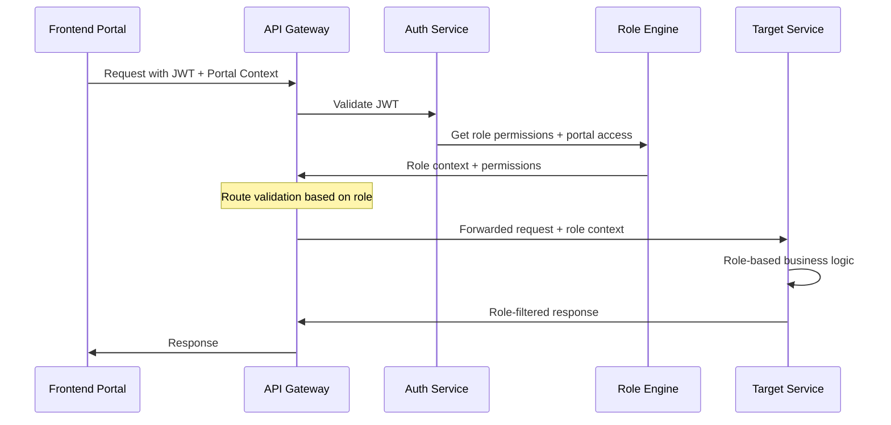

# Gametriggers Platform - Eureka Microservices to Portal Mapping

## Overview

This document provides a detailed mapping of microservices to frontend portals for the Eureka role-based access control system, showing which backend services support each user-facing application in the Gametriggers platform across the three specialized portals.

## Eureka Portal Architecture Map

```
┌─────────────────────────────────────────────────────────────────────────────────────┐
│                           GAMETRIGGERS EUREKA PLATFORM                                │
│                              Role-Based Access Control                                │
└─────────────────────────────────────────────────────────────────────────────────────┘

┌─────────────────┐    ┌─────────────────┐    ┌─────────────────┐    ┌─────────────────┐
│  E1 BRAND       │    │ E3 PUBLISHER    │    │  LANDING SITE   │    │ E2 AD EXCHANGE  │
│  PORTAL         │    │ PORTAL          │    │                 │    │ PORTAL          │
│                 │    │                 │    │                 │    │                 │
│ brands.domain   │    │publishers.domain│    │  www.domain     │    │exchange.domain  │
│   (Next.js)     │    │   (Next.js)     │    │   (Next.js)     │    │   (Next.js)     │
│                 │    │                 │    │                 │    │                 │
│ 9 Brand Roles   │    │ 6 Publisher     │    │ Public Access   │    │ 6 Exchange      │
│                 │    │ Roles           │    │                 │    │ Roles           │
└─────────────────┘    └─────────────────┘    └─────────────────┘    └─────────────────┘

Cross-Portal Role: Super Admin (Access to all E1, E2, E3 portals)
```

## Enhanced Service-to-Portal Mapping Matrix

| Microservice | E1 Brand Portal | E3 Publisher Portal | Landing Site | E2 Exchange Portal | Primary Function |
|--------------|-----------------|-------------------|--------------|---------------------|------------------|
| **Auth Service** | ✅ All Brand Roles | ✅ All Publisher Roles | ✅ Register | ✅ All Exchange Roles | Eureka RBAC authentication |
| **Brand Service** | ✅ Primary (9 roles) | ❌ | ❌ | ✅ Read Only | Brand profile & organization |
| **Publisher Service** | ❌ | ✅ Primary (6 roles) | ❌ | ✅ Monitor | Publisher/streamer management |
| **Campaign Service** | ✅ Primary | ✅ Browse/Participate | ❌ | ✅ Route/Moderate | Campaign lifecycle management |
| **Organization Service** | ✅ Primary | ✅ Agencies | ❌ | ✅ Monitor | Multi-tenant organization mgmt |
| **Workflow Service** | ✅ Approvals | ✅ Onboarding | ❌ | ✅ Internal Ops | Approval & routing workflows |
| **Analytics Service** | ✅ Brand Analytics | ✅ Publisher Analytics | ❌ | ✅ Platform Analytics | Role-based reporting |
| **Payment Service** | ✅ Billing/Budgets | ✅ Payouts | ❌ | ✅ Financial Ops | Financial transaction processing |
| **Wallet Service** | ❌ | ✅ Primary | ❌ | ✅ Monitor | Publisher earnings management |
| **Overlay Service** | ❌ | ✅ Primary | ❌ | ✅ Monitor | Real-time ad delivery |
| **Upload Service** | ✅ Primary | ❌ | ❌ | ✅ Moderate | Asset upload & management |
| **Exchange Service** | 🔄 Receives | 🔄 Receives | ❌ | ✅ Primary | Campaign routing & optimization |
| **Admin Service** | 🔄 Internal Admin | 🔄 Internal Admin | ❌ | ✅ Primary | System administration |
| **Audit Service** | 🔄 Logging | 🔄 Logging | ❌ | ✅ Primary | Compliance & audit logging |
| **Notification Service** | ✅ Secondary | ✅ Secondary | ❌ | ✅ Secondary | Role-based notifications |
| **Event Bus** | 🔄 Internal | 🔄 Internal | ❌ | 🔄 Internal | Inter-service communication |

**Legend:**
- ✅ Primary: Core functionality for portal roles
- ✅ Secondary: Supporting functionality
- ✅ Read Only: Monitoring/read access
- ❌ No direct access
- 🔄 Internal: Infrastructure/cross-portal communication

## Detailed Portal Breakdowns with Eureka Roles

### 1. E1 Brand Portal (brands.gametriggers.com)

**Purpose**: Campaign management, brand operations, and advertiser workflow management

**Target Roles (9 roles):**
- **Marketing Head**: Organization setup, team management, budget allocation, high-level strategy
- **Campaign Manager**: Campaign creation, management, targeting, performance analysis  
- **Finance Manager**: Budget controls, payment methods, financial reporting, spending oversight
- **Validator/Approver**: Campaign validation, approval workflows, routing to ad exchange
- **Campaign Consultant**: Client campaign management (with consent), analytics, no finance access
- **Admin (Brand)**: Account management, sales rep coordination, troubleshooting, user management
- **Sales Representative**: Client onboarding, CRM management, guidance, issue resolution
- **Support 1 (Brand)**: Basic advertiser support, navigation help, documentation, escalation
- **Support 2 (Brand)**: Complex issue resolution, technical troubleshooting, cross-team coordination

**Primary Services:**
- **Brand Service**: Company profiles, team management, advertiser account setup
- **Campaign Service**: Campaign lifecycle, targeting, scheduling, management
- **Organization Service**: Multi-tenant organization management, hierarchy, budget allocation
- **Analytics Service**: Campaign performance, ROI analysis, audience insights
- **Payment Service**: Billing, invoicing, budget controls, financial reporting
- **Upload Service**: Asset management, creative library, media processing
- **Workflow Service**: Approval processes, routing, validation workflows

**Supporting Services:**
- **Auth Service**: Role-based authentication, permission management
- **Notification Service**: Campaign alerts, budget notifications, approval requests

**Key Features by Role:**
```typescript
// E1 Brand Portal Role-Based Features
interface BrandPortalFeatures {
  marketingHead: {
    organizationManagement: boolean;
    teamRoleAssignment: boolean;
    budgetAllocation: boolean;
    highLevelAnalytics: boolean;
    strategicPlanning: boolean;
  };
  campaignManager: {
    campaignCreation: boolean;
    targetingConfiguration: boolean;
    performanceOptimization: boolean;
    creativeManagement: boolean;
    teamCollaboration: boolean;
  };
  financeManager: {
    budgetManagement: boolean;
    paymentMethodSetup: boolean;
    financialReporting: boolean;
    spendingControls: boolean;
    billingOversight: boolean;
  };
  validatorApprover: {
    campaignValidation: boolean;
    approvalWorkflows: boolean;
    complianceChecking: boolean;
    routingToExchange: boolean;
  };
  campaignConsultant: {
    clientCampaignManagement: boolean;
    performanceAnalytics: boolean;
    strategicGuidance: boolean;
    // No financial access
  };
  // Additional roles...
}
```

### 2. E3 Publisher Portal (publishers.gametriggers.com)

**Purpose**: Publisher/streamer management, overlay operations, and earnings tracking

**Target Roles (6 roles):**
- **Artiste Manager**: Publisher recruitment, agency management, performance oversight, team coordination
- **Streamer (Individual)**: Campaign participation, overlay management, content creation, earnings tracking
- **Independent Publisher**: Self-managed operations, direct campaign access, autonomous payout management
- **Liaison Manager**: Publisher support, onboarding assistance, dispute resolution, performance guidance
- **Support 1 (Publisher)**: Basic publisher queries, platform navigation, process guidance
- **Support 2 (Publisher)**: Complex technical issues, advanced troubleshooting, redemption problems

**Primary Services:**
- **Publisher Service**: Publisher profiles, platform integrations, verification, management tools
- **Organization Service**: Agency management, multi-publisher coordination, hierarchical structures
- **Participation Service**: Campaign participation, bidding, history tracking, preference management
- **Overlay Service**: Real-time overlay management, customization, testing, delivery
- **Wallet Service**: Earnings tracking, payout requests, financial history, tax reporting
- **Analytics Service**: Publisher performance, revenue optimization, audience insights

**Supporting Services:**
- **Auth Service**: OAuth integrations, role-based access, publisher verification
- **Campaign Service**: Available campaign browsing, participation opportunities
- **Payment Service**: Payout processing, earnings distribution
- **Workflow Service**: Onboarding workflows, dispute resolution processes

**Key Features by Role:**
```typescript
// E3 Publisher Portal Role-Based Features
interface PublisherPortalFeatures {
  artisteManager: {
    publisherRecruitment: boolean;
    agencyManagement: boolean;
    performanceMonitoring: boolean;
    payoutDistribution: boolean;
    teamCoordination: boolean;
  };
  streamerIndividual: {
    campaignParticipation: boolean;
    overlayCustomization: boolean;
    earningsTracking: boolean;
    platformIntegration: boolean;
    contentManagement: boolean;
  };
  independentPublisher: {
    autonomousOperations: boolean;
    directCampaignAccess: boolean;
    selfManagedPayouts: boolean;
    advancedAnalytics: boolean;
  };
  liaisonManager: {
    publisherSupport: boolean;
    onboardingAssistance: boolean;
    disputeResolution: boolean;
    performanceGuidance: boolean;
  };
  // Support roles...
}
```

### 3. E2 Ad Exchange Portal (exchange.gametriggers.com)

**Purpose**: Internal platform operations, campaign routing, and system management

**Target Roles (6 roles):**
- **Admin (Exchange)**: Internal workflow management, team coordination, escalation handling
- **Platform Success Manager**: System optimization, pricing logic, platform configuration, uptime management
- **Customer Success Manager**: Advertiser satisfaction, optimization feedback, cross-platform coordination
- **Campaign Success Manager**: Campaign routing, inventory matching, performance oversight
- **Support 1 (Exchange)**: Internal support queries, navigation assistance, FAQ management
- **Support 2 (Exchange)**: Technical issue resolution, API troubleshooting, developer coordination

**Primary Services:**
- **Exchange Service**: Campaign routing, inventory management, pricing optimization, platform logic
- **Admin Service**: System administration, user management, platform configuration
- **Workflow Service**: Internal operational workflows, escalation management, process automation
- **Analytics Service**: Platform-wide analytics, performance metrics, optimization insights
- **Audit Service**: Compliance monitoring, activity logging, security oversight

**Supporting Services:**
- All other services for monitoring and management purposes
- Cross-portal coordination and oversight capabilities

**Key Features by Role:**
```typescript
// E2 Exchange Portal Role-Based Features
interface ExchangePortalFeatures {
  adminExchange: {
    internalWorkflows: boolean;
    teamManagement: boolean;
    escalationHandling: boolean;
    processOptimization: boolean;
  };
  platformSuccessManager: {
    systemOptimization: boolean;
    pricingLogicConfig: boolean;
    platformConfiguration: boolean;
    uptimeManagement: boolean;
    tokenConversionRules: boolean;
  };
  customerSuccessManager: {
    advertiserSatisfaction: boolean;
    optimizationFeedback: boolean;
    crossPlatformCoordination: boolean;
    relationshipManagement: boolean;
  };
  campaignSuccessManager: {
    campaignRouting: boolean;
    inventoryMatching: boolean;
    performanceOversight: boolean;
    analyticsGeneration: boolean;
  };
  // Support roles...
}
```

### 4. Landing Site (gametriggers.com)

**Purpose**: Public marketing, role-based onboarding, and information portal

**Target Users:** General public, prospective users seeking role-specific information

**Primary Services:**
- **Auth Service**: Role-based registration flows, initial portal routing
- Static content delivery with role-specific information

**Key Features:**
```typescript
// Landing Site Features
interface LandingSiteFeatures {
  marketing: {
    brandPortalOverview: boolean;
    publisherPortalOverview: boolean;
    exchangePortalInfo: boolean;
    roleBasedPricing: boolean;
    testimonials: boolean;
  };
  onboarding: {
    roleBasedRegistration: boolean;
    portalSelection: boolean;
    organizationSetup: boolean;
    initialRoleAssignment: boolean;
  };
  information: {
    roleDocumentation: boolean;
    featureComparison: boolean;
    pricingTiers: boolean;
    supportResources: boolean;
  };
}
```

## Cross-Portal Super Admin Access

**Super Admin Role**: Unrestricted access across all three portals (E1, E2, E3)

**Capabilities:**
- Full read/write/delete permissions on all entities
- Cross-portal user management and role transitions  
- Override capabilities for any workflow or approval process
- Global platform configuration and emergency controls
- Complete audit trail access and compliance management
- System-wide monitoring and health oversight

## Enhanced API Gateway Routing Strategy

### Role-Based Route Discovery
```yaml
# API Gateway Routing Configuration with RBAC
routes:
  # Authentication routes (all portals, role-aware)
  "/api/auth/*": 
    service: auth-service
    rbac: role-based-session-management
  
  # E1 Brand Portal specific routes
  "/api/brands/*": 
    service: brand-service
    allowed_roles: [marketing_head, campaign_manager, admin_brand, sales_rep, consultant, validator, finance_manager, support_1_brand, support_2_brand]
    
  "/api/campaigns/*": 
    service: campaign-service
    allowed_roles: [marketing_head, campaign_manager, validator_approver, consultant]
    
  "/api/organizations/*": 
    service: organization-service
    allowed_roles: [marketing_head, admin_brand, super_admin]
    
  "/api/uploads/*": 
    service: upload-service
    allowed_roles: [campaign_manager, marketing_head]
    
  "/api/workflows/brand/*": 
    service: workflow-service
    allowed_roles: [validator_approver, marketing_head, admin_brand]
  
  # E3 Publisher Portal specific routes
  "/api/publishers/*": 
    service: publisher-service
    allowed_roles: [artiste_manager, streamer_individual, independent_publisher, liaison_manager, support_1_publisher, support_2_publisher]
    
  "/api/overlay/*": 
    service: overlay-service
    allowed_roles: [streamer_individual, independent_publisher, artiste_manager]
    
  "/api/participation/*": 
    service: participation-service
    allowed_roles: [streamer_individual, independent_publisher, artiste_manager]
    
  "/api/wallet/*": 
    service: wallet-service
    allowed_roles: [streamer_individual, independent_publisher, artiste_manager, liaison_manager]
  
  # E2 Exchange Portal specific routes
  "/api/exchange/*": 
    service: exchange-service
    allowed_roles: [admin_exchange, platform_success_manager, customer_success_manager, campaign_success_manager, support_1_exchange, support_2_exchange]
    
  "/api/admin/*": 
    service: admin-service
    allowed_roles: [admin_exchange, platform_success_manager, super_admin]
    
  "/api/audit/*": 
    service: audit-service
    allowed_roles: [super_admin, admin_exchange]
  
  # Shared routes (role-contextual access)
  "/api/payments/*": 
    service: payment-service
    context_based: true # Access varies by role context
    
  "/api/notifications/*": 
    service: notification-service
    context_based: true
    
  "/api/analytics/*": 
    service: analytics-service
    context_based: true # Different data access per role

  # Super Admin routes (cross-portal access)
  "/api/super-admin/*":
    service: admin-service
    allowed_roles: [super_admin]
    cross_portal: true
```

### Enhanced Authentication & Authorization Flow


## Enhanced Database Distribution Strategy

### Service-Specific Database Assignments with RBAC

**MongoDB Clusters:**
```yaml
# Primary MongoDB cluster for RBAC and document-based data
auth_rbac_cluster:
  services: [auth-service, organization-service]
  collections: [users, roles, permissions, organizations, oauth_tokens, sessions]
  
users_profiles_cluster:
  services: [brand-service, publisher-service]
  collections: [brands, publishers, profiles, integrations, preferences]

campaigns_workflows_cluster:
  services: [campaign-service, workflow-service, participation-service, upload-service]
  collections: [campaigns, participations, workflows, assets, targeting_rules, approvals]

overlay_realtime_cluster:
  services: [overlay-service, notification-service, exchange-service]
  collections: [overlay_configs, notifications, real_time_data, routing_rules, pricing_logic]
```

**PostgreSQL Instances:**
```yaml
# Relational data requiring ACID compliance and complex queries
analytics_reporting_db:
  service: analytics-service
  tables: [events, metrics, aggregations, reports, role_based_views]
  partitioning: by_portal_and_date

financial_transactions_db:
  service: payment-service
  tables: [transactions, invoices, payouts, financial_records, budget_controls, approval_chains]
  compliance: PCI_DSS, audit_ready

admin_audit_db:
  service: admin-service, audit-service
  tables: [audit_logs, system_configs, admin_actions, compliance_reports, security_events]
  retention: 7_years
```

**Redis Instances:**
```yaml
# Caching and real-time data with role-based partitioning
session_auth_cache:
  services: [auth-service, api-gateway]
  data: [sessions, jwt_tokens, role_permissions, rate_limits]
  ttl: role_based_expiration

overlay_delivery_cache:
  services: [overlay-service, analytics-service, exchange-service]  
  data: [real_time_metrics, active_campaigns, delivery_queue, routing_decisions]
  ttl: seconds_to_minutes

workflow_state_cache:
  services: [workflow-service, organization-service]
  data: [approval_states, pending_workflows, escalation_queues, notification_queues]
  ttl: hours_to_days
```

## Enhanced Deployment Strategy

### Container Orchestration with Role-Based Services
```yaml
# Kubernetes deployment strategy for Eureka RBAC
namespaces:
  frontend_portals:
    - e1-brand-portal
    - e3-publisher-portal  
    - e2-exchange-portal
    - landing-site
  
  core_services:
    - auth-service
    - organization-service
    - workflow-service
    
  business_services:
    - brand-service
    - publisher-service
    - campaign-service
    - analytics-service
    - payment-service
    
  platform_services:
    - exchange-service
    - overlay-service
    - upload-service
    - admin-service
  
  infrastructure:
    - api-gateway
    - event-bus
    - monitoring
    - rbac-engine
```

### Enhanced Service Dependencies
```yaml
startup_order:
  tier_1: [databases, redis, event-bus]
  tier_2: [auth-service, rbac-engine]
  tier_3: [organization-service, admin-service]  
  tier_4: [brand-service, publisher-service, payment-service]
  tier_5: [campaign-service, workflow-service, analytics-service]
  tier_6: [exchange-service, overlay-service, upload-service]
  tier_7: [api-gateway-with-rbac]
  tier_8: [frontend-portals]
```

## Enhanced Monitoring & Observability

### Role-Based Service Health Monitoring
```typescript
interface EurekaServiceHealthMetrics {
  // Core RBAC Services
  auth: RBACHealthCheck;
  organization: HealthCheck;
  workflow: HealthCheck;
  
  // Portal-Specific Services  
  brand: HealthCheck;
  publisher: HealthCheck;
  exchange: HealthCheck;
  
  // Business Services
  campaign: HealthCheck;
  analytics: HealthCheck;
  payment: HealthCheck;
  overlay: HealthCheck;
  
  // Platform Services
  admin: HealthCheck;
  audit: HealthCheck;
  upload: HealthCheck;
}

interface RBACHealthCheck extends HealthCheck {
  roleValidationLatency: number;
  permissionCheckLatency: number;
  activeRoleSessions: number;
  failedRoleChecks: number;
}

interface PortalHealthMetrics {
  e1BrandPortal: FrontendHealth;
  e3PublisherPortal: FrontendHealth;
  e2ExchangePortal: FrontendHealth;
  landingSite: FrontendHealth;
}
```

### Role-Based Audit Trail Monitoring
```typescript
interface RoleBasedAuditMetrics {
  // Per-role activity tracking
  roleActivity: {
    [key in EurekaRole]: {
      sessionsActive: number;
      actionsPerformed: number;
      permissionViolations: number;
      averageSessionDuration: number;
    }
  };
  
  // Cross-portal activity
  crossPortalAccess: {
    superAdminSessions: number;
    portalSwitches: number;
    crossPortalActions: number;
  };
  
  // Workflow monitoring
  workflowHealth: {
    pendingApprovals: number;
    averageApprovalTime: number;
    escalationRate: number;
    workflowCompletionRate: number;
  };
}
```

### Cross-Service Role Tracing
- Role-based request tracing across service boundaries
- Permission validation performance monitoring  
- Role transition and workflow tracking
- Cross-portal activity correlation
- Hierarchical permission audit trails

## Enhanced Development Guidelines

### RBAC-Aware Service Development Standards
1. **Role Validation**: Each service validates incoming role context
2. **Permission Checking**: Granular permission validation at method level  
3. **Audit Logging**: All role-based actions logged with context
4. **Workflow Integration**: Services participate in approval workflows
5. **Cross-Portal Awareness**: Services handle multi-portal role scenarios

### Portal Development Standards with RBAC
1. **Role-Based Components**: UI components adapt based on user roles
2. **Permission Gates**: Render control based on granular permissions
3. **Portal Context**: Maintain portal-specific user context
4. **Role Transition**: Support for users with multi-portal access
5. **Workflow UX**: Integrated approval and workflow interfaces

### Role-Based API Design Patterns
```typescript
// Example: Role-aware service method
@Controller('campaigns')
@UseGuards(RoleGuard)
export class CampaignController {
  
  @Post()
  @RequireRoles(EurekaRole.CAMPAIGN_MANAGER, EurekaRole.MARKETING_HEAD)
  @RequirePermissions(Permission.CREATE_CAMPAIGN)
  @RequirePortal(Portal.E1_BRAND)
  async createCampaign(
    @Body() dto: CreateCampaignDto,
    @CurrentUser() user: RoleAwareUser
  ) {
    // Role-specific business logic
    return this.campaignService.create(dto, user);
  }
  
  @Put(':id/approve')
  @RequireRoles(EurekaRole.VALIDATOR_APPROVER)
  @RequireWorkflowPermission(WorkflowType.CAMPAIGN_APPROVAL)
  async approveCampaign(
    @Param('id') campaignId: string,
    @CurrentUser() user: RoleAwareUser
  ) {
    return this.workflowService.approve(campaignId, user);
  }
}
```

This comprehensive mapping ensures the Eureka role-based access control system is properly integrated across all microservices and portals, providing secure, scalable, and maintainable access control for the entire Gametriggers platform.
