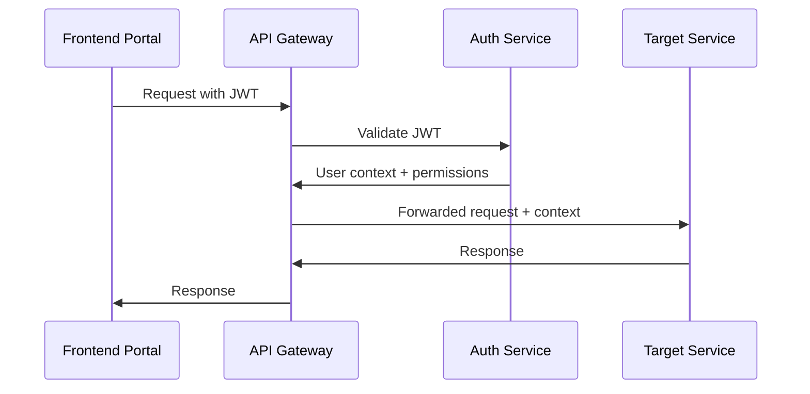

# Gametriggers Platform - Microservices to Portal Mapping

## Overview

This document provides a detailed mapping of microservices to frontend portals, showing which backend services support each user-facing application in the Gametriggers platform.

## Portal Architecture Map

```
┌─────────────────────────────────────────────────────────────────────────────────────┐
│                                GAMETRIGGERS PLATFORM                                   │
└─────────────────────────────────────────────────────────────────────────────────────┘

┌─────────────────┐    ┌─────────────────┐    ┌─────────────────┐    ┌─────────────────┐
│   BRAND PORTAL  │    │ STREAMER PORTAL │    │  LANDING SITE   │    │  ADMIN PORTAL   │
│                 │    │                 │    │                 │    │                 │
│ brands.domain   │    │streamers.domain │    │  www.domain     │    │ admin.domain    │
│   (Next.js)     │    │   (Next.js)     │    │   (Next.js)     │    │   (Next.js)     │
└─────────────────┘    └─────────────────┘    └─────────────────┘    └─────────────────┘
```

## Service-to-Portal Mapping Matrix

| Microservice | Brand Portal | Streamer Portal | Landing Site | Admin Portal | Primary Function |
|--------------|--------------|-----------------|--------------|--------------|------------------|
| **Auth Service** | ✅ Auth | ✅ Auth | ✅ Register | ✅ Auth | User authentication & management |
| **Brand Service** | ✅ Primary | ❌ | ❌ | ✅ Read | Brand profile & company management |
| **Streamer Service** | ❌ | ✅ Primary | ❌ | ✅ Read | Streamer profile & integration setup |
| **Campaign Service** | ✅ Primary | ✅ Browse | ❌ | ✅ Moderate | Campaign creation & management |
| **Participation Service** | ✅ View | ✅ Primary | ❌ | ✅ Monitor | Campaign participation tracking |
| **Analytics Service** | ✅ Primary | ✅ Primary | ❌ | ✅ Monitor | Performance metrics & reporting |
| **Payment Service** | ✅ Primary | ✅ Payouts | ❌ | ✅ Monitor | Financial transactions |
| **Wallet Service** | ❌ | ✅ Primary | ❌ | ✅ Monitor | Streamer earnings management |
| **Overlay Service** | ❌ | ✅ Primary | ❌ | ✅ Monitor | Real-time ad delivery |
| **Upload Service** | ✅ Primary | ❌ | ❌ | ✅ Moderate | Asset upload & management |
| **Admin Service** | ❌ | ❌ | ❌ | ✅ Primary | Platform administration |
| **Audit Service** | ❌ | ❌ | ❌ | ✅ Primary | System audit & compliance |
| **Notification Service** | ✅ Secondary | ✅ Secondary | ❌ | ✅ Secondary | User notifications |
| **Event Bus** | 🔄 Internal | 🔄 Internal | ❌ | 🔄 Internal | Inter-service communication |

**Legend:**
- ✅ Primary: Core functionality for this portal
- ✅ Secondary: Supporting functionality
- ✅ Read: Read-only access for monitoring
- ❌ No direct access
- 🔄 Internal: Infrastructure service

## Detailed Portal Breakdowns

### 1. Brand Portal (brands.gametriggers.com)

**Purpose**: Complete campaign management and brand operations platform

**Primary Services:**
- **Brand Service**: Company profile, billing settings, team management
- **Campaign Service**: Campaign creation, editing, targeting, scheduling
- **Analytics Service**: Campaign performance, ROI analysis, audience insights
- **Payment Service**: Billing, invoicing, payment method management
- **Upload Service**: Asset upload, media library, creative management

**Supporting Services:**
- **Auth Service**: Authentication, session management
- **Participation Service**: View participating streamers
- **Notification Service**: Campaign alerts, billing notifications

**Key Features:**
```typescript
// Brand Portal Feature Set
interface BrandPortalFeatures {
  campaignManagement: {
    create: boolean;
    edit: boolean;
    schedule: boolean;
    targeting: boolean;
    budgetControl: boolean;
  };
  analytics: {
    realTimeMetrics: boolean;
    historicalReports: boolean;
    roiAnalysis: boolean;
    audienceInsights: boolean;
  };
  assetManagement: {
    upload: boolean;
    library: boolean;
    mediaPreview: boolean;
    bulkOperations: boolean;
  };
  financial: {
    billing: boolean;
    invoicing: boolean;
    paymentMethods: boolean;
    spendingAlerts: boolean;
  };
}
```

### 2. Streamer Portal (streamers.gametriggers.com)

**Purpose**: Streamer onboarding, overlay management, and earnings tracking

**Primary Services:**
- **Streamer Service**: Profile setup, platform integrations, preferences
- **Overlay Service**: Overlay configuration, testing, real-time control
- **Participation Service**: Campaign browsing, opt-in/out, participation history
- **Wallet Service**: Earnings tracking, payout requests, financial history
- **Analytics Service**: Performance metrics, revenue optimization

**Supporting Services:**
- **Auth Service**: Authentication, OAuth integrations
- **Campaign Service**: Browse available campaigns
- **Payment Service**: Payout processing
- **Notification Service**: Earnings alerts, campaign notifications

**Key Features:**
```typescript
// Streamer Portal Feature Set
interface StreamerPortalFeatures {
  overlayManagement: {
    configuration: boolean;
    testing: boolean;
    realTimeControl: boolean;
    customization: boolean;
  };
  earnings: {
    realTimeTracking: boolean;
    payoutRequests: boolean;
    historicalData: boolean;
    taxReporting: boolean;
  };
  campaignParticipation: {
    browseCampaigns: boolean;
    optInOut: boolean;
    preferenceSettings: boolean;
    participationHistory: boolean;
  };
  analytics: {
    performanceMetrics: boolean;
    revenueOptimization: boolean;
    audienceInsights: boolean;
  };
}
```

### 3. Landing Site (gametriggers.com)

**Purpose**: Marketing, onboarding, and public information

**Primary Services:**
- **Auth Service**: User registration, initial onboarding
- Static content delivery (marketing pages, documentation)

**Supporting Services:**
- Minimal backend dependencies for optimal performance
- CDN integration for static assets

**Key Features:**
```typescript
// Landing Site Feature Set
interface LandingSiteFeatures {
  marketing: {
    productOverview: boolean;
    pricing: boolean;
    testimonials: boolean;
    caseStudies: boolean;
  };
  onboarding: {
    userRegistration: boolean;
    roleSelection: boolean;
    initialSetup: boolean;
  };
  support: {
    documentation: boolean;
    faq: boolean;
    contactForms: boolean;
  };
}
```

### 4. Admin Portal (admin.gametriggers.com)

**Purpose**: Platform administration, monitoring, and compliance

**Primary Services:**
- **Admin Service**: Platform configuration, user management, system controls
- **Audit Service**: Compliance tracking, activity logs, security monitoring

**Monitoring Access to All Services:**
- **Auth Service**: User account management
- **Brand Service**: Brand verification, moderation
- **Streamer Service**: Streamer verification, platform compliance
- **Campaign Service**: Content moderation, policy enforcement
- **Analytics Service**: Platform-wide metrics
- **Payment Service**: Financial oversight, fraud detection
- **All other services**: Health monitoring, performance metrics

**Key Features:**
```typescript
// Admin Portal Feature Set
interface AdminPortalFeatures {
  userManagement: {
    search: boolean;
    verification: boolean;
    suspension: boolean;
    roleManagement: boolean;
  };
  contentModeration: {
    campaignReview: boolean;
    assetApproval: boolean;
    policyEnforcement: boolean;
  };
  systemMonitoring: {
    serviceHealth: boolean;
    performanceMetrics: boolean;
    alertManagement: boolean;
  };
  compliance: {
    auditLogs: boolean;
    reportGeneration: boolean;
    dataManagement: boolean;
  };
}
```

## API Gateway Routing Strategy

### Route-Based Service Discovery
```yaml
# API Gateway Routing Configuration
routes:
  # Authentication routes (all portals)
  "/api/auth/*": auth-service
  
  # Brand Portal specific routes
  "/api/brands/*": brand-service
  "/api/campaigns/*": campaign-service
  "/api/uploads/*": upload-service
  "/api/analytics/brands/*": analytics-service
  
  # Streamer Portal specific routes
  "/api/streamers/*": streamer-service
  "/api/overlay/*": overlay-service
  "/api/participation/*": participation-service
  "/api/wallet/*": wallet-service
  "/api/analytics/streamers/*": analytics-service
  
  # Admin Portal specific routes
  "/api/admin/*": admin-service
  "/api/audit/*": audit-service
  "/api/system/*": admin-service
  
  # Shared routes (contextual access)
  "/api/payments/*": payment-service
  "/api/notifications/*": notification-service
  "/api/analytics/*": analytics-service
```

### Authentication & Authorization Flow


## Database Distribution Strategy

### Service-Specific Database Assignments

**MongoDB Clusters:**
```yaml
# Primary MongoDB cluster for document-based data
users_cluster:
  services: [auth-service, brand-service, streamer-service]
  collections: [users, brands, streamers, oauth_tokens]

campaigns_cluster:
  services: [campaign-service, participation-service, upload-service]
  collections: [campaigns, participations, assets, targeting_rules]

overlay_cluster:
  services: [overlay-service, notification-service]
  collections: [overlay_configs, notifications, real_time_data]
```

**PostgreSQL Instances:**
```yaml
# Relational data requiring ACID compliance
analytics_db:
  service: analytics-service
  tables: [events, metrics, aggregations, reports]

payments_db:
  service: payment-service
  tables: [transactions, invoices, payouts, financial_records]

admin_db:
  service: admin-service, audit-service
  tables: [audit_logs, system_configs, admin_actions]
```

**Redis Instances:**
```yaml
# Caching and real-time data
session_cache:
  services: [auth-service, api-gateway]
  data: [sessions, jwt_tokens, rate_limits]

overlay_cache:
  services: [overlay-service, analytics-service]
  data: [real_time_metrics, active_campaigns, delivery_queue]
```

## Deployment Strategy

### Container Orchestration
```yaml
# Kubernetes deployment strategy
namespaces:
  frontend:
    - brand-portal
    - streamer-portal
    - landing-site
    - admin-portal
  
  backend:
    - auth-service
    - brand-service
    - streamer-service
    - campaign-service
    - analytics-service
    - payment-service
    - overlay-service
    - admin-service
  
  infrastructure:
    - api-gateway
    - event-bus
    - monitoring
```

### Service Dependencies
```yaml
startup_order:
  tier_1: [databases, redis, event-bus]
  tier_2: [auth-service, admin-service]
  tier_3: [brand-service, streamer-service, payment-service]
  tier_4: [campaign-service, overlay-service, analytics-service]
  tier_5: [api-gateway]
  tier_6: [frontend-portals]
```

## Monitoring & Observability

### Service Health Monitoring
```typescript
interface ServiceHealthMetrics {
  auth: HealthCheck;
  brand: HealthCheck;
  streamer: HealthCheck;
  campaign: HealthCheck;
  analytics: HealthCheck;
  payment: HealthCheck;
  overlay: HealthCheck;
  admin: HealthCheck;
}

interface PortalHealthMetrics {
  brandPortal: FrontendHealth;
  streamerPortal: FrontendHealth;
  landingSite: FrontendHealth;
  adminPortal: FrontendHealth;
}
```

### Cross-Service Tracing
- Request tracing across service boundaries
- Performance monitoring for each portal
- Error tracking and alerting
- Service dependency mapping

## Development Guidelines

### Service Development Standards
1. Each service maintains its own repository
2. Independent deployment pipelines
3. Shared TypeScript types via npm packages
4. Common authentication middleware
5. Standardized API response formats

### Portal Development Standards
1. Shared component library (shadcn/ui)
2. Common authentication hooks
3. Standardized routing patterns
4. Consistent error handling
5. Performance monitoring integration

This mapping ensures clear separation of concerns while maintaining efficient communication between services and optimal user experiences across all portals.
