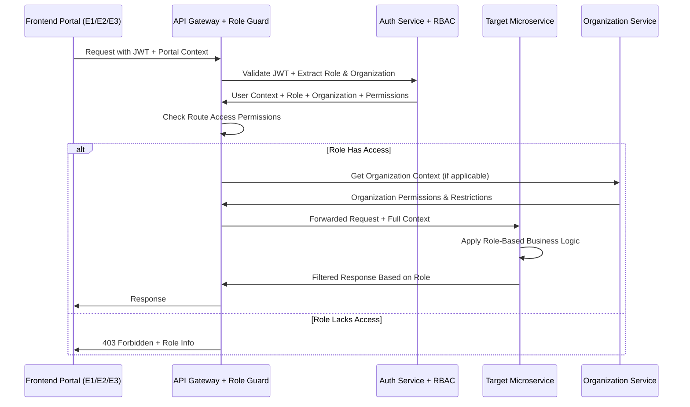

# Gametriggers Platform - Microservices to Portal Mapping with Eureka Role System

## Overview

This document provides a detailed mapping of microservices to frontend portals, showing which backend services support each user-facing application in the Gametriggers platform. The platform implements the Eureka multi-portal role system with specialized access control across E1 (Brand), E2 (Admin), and E3 (Streamer) portals.

## Portal Architecture Map with Eureka System

```
┌─────────────────────────────────────────────────────────────────────────────────────┐
│                                GAMETRIGGERS PLATFORM                                   │
│                              EUREKA MULTI-PORTAL SYSTEM                                │
└─────────────────────────────────────────────────────────────────────────────────────┘

┌─────────────────┐    ┌─────────────────┐    ┌─────────────────┐    ┌─────────────────┐
│   BRAND PORTAL  │    │ STREAMER PORTAL │    │  LANDING SITE   │    │  ADMIN PORTAL   │
│      (E1)       │    │      (E3)       │    │   (PUBLIC)      │    │      (E2)       │
│                 │    │                 │    │                 │    │                 │
│ brands.domain   │    │streamers.domain │    │  www.domain     │    │ admin.domain    │
│   (Next.js)     │    │   (Next.js)     │    │   (Next.js)     │    │   (Next.js)     │
│                 │    │                 │    │                 │    │                 │
│ 8 Roles         │    │ 8 Roles         │    │ Public Access   │    │ 7 Roles         │
│ 5 Hierarchy     │    │ 5 Hierarchy     │    │ + Registration  │    │ 5 Hierarchy     │
│ Levels          │    │ Levels          │    │                 │    │ Levels          │
└─────────────────┘    └─────────────────┘    └─────────────────┘    └─────────────────┘
         │                       │                       │                       │
         └───────────────────────┼───────────────────────┼───────────────────────┘
                                 │                       │
                    ┌─────────────────┐                  │
                    │   API GATEWAY   │                  │
                    │   (Express)     │                  │
                    │ + Role Guards   │                  │
                    └─────────────────┘                  │
                                 │                       │
    ┌────────────────────────────┼────────────────────────────┬─────────────────┘
    │                            │                            │
┌───▼───┐  ┌─────────┐  ┌───────▼──┐  ┌─────────┐  ┌─────────┐  ┌─────────┐
│  Auth  │  │ Brand   │  │ Streamer │  │Campaign │  │Analytics│  │  Admin  │
│Service │  │ Service │  │ Service  │  │ Service │  │ Service │  │ Service │
│+ RBAC  │  │+ Orgs   │  │+ Agencies│  │+ Approval│ │+ Portal │  │+ Cross  │
└───────┘  └─────────┘  └──────────┘  └─────────┘  └─────────┘  └─────────┘
    │          │             │            │            │            │
┌───▼───┐  ┌───▼───┐     ┌───▼───┐    ┌───▼───┐    ┌───▼───┐    ┌───▼───┐
│Payment│  │Overlay│     │Wallet │    │Upload │    │ Event │    │Audit  │
│Service│  │Service│     │Service│    │Service│    │ Bus   │    │Service│
│+ Multi │  │+ Real │     │+ Hier │    │+ Role │    │+ Role │    │+ Comp │
└───────┘  └───────┘     └───────┘    └───────┘    └───────┘    └───────┘
```

## Eureka Role-Based Service Mapping Matrix

| Microservice | E1 - Brand Portal | E3 - Streamer Portal | Public Site | E2 - Admin Portal | Role-Based Features |
|--------------|-------------------|--------------------|-------------|-------------------|---------------------|
| **Auth Service** | ✅ Multi-Role Auth | ✅ OAuth-Only Auth | ✅ Email Registration | ✅ Admin Auth | Role assignment, organization context, cross-portal access |
| **Brand Service** | ✅ Primary (8 roles) | ❌ | ❌ | ✅ Oversight | Organization management, hierarchical permissions, team collaboration |
| **Streamer Service** | ❌ | ✅ Primary (8 roles) | ❌ | ✅ Oversight | Agency management, creator hierarchies, earnings distribution |
| **Campaign Service** | ✅ Primary (Approval Chain) | ✅ Participation | ❌ | ✅ E1→E2→E3 Flow | Role-based approval workflows, cross-portal campaign routing |
| **Participation Service** | ✅ View (Limited) | ✅ Primary (Filtered) | ❌ | ✅ Monitor All | Hierarchical participation control, agency-level management |
| **Analytics Service** | ✅ Role-Filtered | ✅ Role-Filtered | ❌ | ✅ Global View | Permission-based data access, organizational analytics |
| **Payment Service** | ✅ Finance Roles | ✅ Payout Roles | ❌ | ✅ Financial Oversight | Role-based financial permissions, approval hierarchies |
| **Wallet Service** | ❌ | ✅ Primary (Hierarchical) | ❌ | ✅ Monitor | Agency-level wallet management, individual creator earnings |
| **Overlay Service** | ❌ | ✅ Primary (Permission-Based) | ❌ | ✅ System Control | Role-based overlay customization, agency branding |
| **Upload Service** | ✅ Primary (Approval Chain) | ❌ | ❌ | ✅ Content Moderation | Role-based upload permissions, approval workflows |
| **Admin Service** | ❌ | ❌ | ❌ | ✅ Primary (7 roles) | Cross-portal administration, escalation management |
| **Audit Service** | ❌ | ❌ | ❌ | ✅ Primary (Compliance) | Role-based audit access, organizational compliance |
| **Organization Service** | ✅ Brand Orgs | ✅ Streamer Agencies | ❌ | ✅ All Organizations | Multi-tenant organization management, role inheritance |

**Enhanced Legend:**
- ✅ Primary: Core functionality with role-based access control
- ✅ Role-Filtered: Access filtered by user role and organizational context
- ✅ Oversight: Administrative oversight with cross-organizational visibility
- ❌ No direct access
- 🔄 Internal: Infrastructure service with role-aware routing

## Detailed Portal Breakdowns with Eureka Role System

### 1. Brand Portal - E1 (brands.gametriggers.com)

**Purpose**: Complete campaign management and brand operations with hierarchical team structure

**Eureka Role Hierarchy (8 roles across 5 levels):**
- **Level 1**: Marketing Head - Organization creator, full platform access
- **Level 2**: Campaign Manager, Finance Manager, Validator/Approver - Core operational roles
- **Level 3**: Campaign Consultant - Client service role with limited financial access
- **Level 4**: Sales Representative, Brand Support 2 - Customer-facing support roles
- **Level 5**: Brand Support 1 - Basic support and documentation assistance

**Primary Services with Role-Based Access:**
- **Brand Service**: Organization management, team hierarchy, role-based permissions
- **Campaign Service**: Role-based campaign creation, approval workflows, team collaboration
- **Analytics Service**: Hierarchical data access, role-filtered reporting, team performance metrics
- **Payment Service**: Finance role access, budget management, organizational billing
- **Upload Service**: Role-based asset management, approval workflows, team asset sharing

**Supporting Services:**
- **Auth Service**: Email/business registration, multi-role authentication, organizational context
- **Participation Service**: View participating streamers (role-filtered visibility)
- **Notification Service**: Role-based alerts, organizational notifications

**Role-Based Features:**
```typescript
// E1 Brand Portal Role-Based Feature Matrix
interface E1PortalFeatures {
  organizationManagement: {
    createOrganization: ['marketing_head'];
    inviteMembers: ['marketing_head'];
    assignRoles: ['marketing_head'];
    manageBudgets: ['marketing_head', 'finance_manager'];
  };
  campaignManagement: {
    create: ['marketing_head', 'campaign_manager', 'campaign_consultant'];
    approve: ['marketing_head', 'validator_approver'];
    edit: ['marketing_head', 'campaign_manager'];
    viewAnalytics: ['marketing_head', 'campaign_manager', 'finance_manager'];
  };
  financialOperations: {
    setBudgets: ['marketing_head', 'finance_manager'];
    viewSpending: ['marketing_head', 'finance_manager', 'campaign_manager'];
    processPayments: ['marketing_head', 'finance_manager'];
    generateReports: ['marketing_head', 'finance_manager'];
  };
  supportOperations: {
    accessCRM: ['sales_representative', 'brand_support_2'];
    escalateIssues: ['brand_support_1', 'brand_support_2'];
    provideTechnicalSupport: ['brand_support_2'];
  };
}
```

### 2. Streamer Portal - E3 (streamers.gametriggers.com)

**Purpose**: Creator onboarding, agency management, and earnings optimization

**Eureka Role Hierarchy (8 roles across 5 levels):**
- **Level 1**: Organization/Agency Head, Independent Streamer - Top-level management
- **Level 2**: Artiste Manager, Finance/Wallet Manager - Agency operational roles
- **Level 3**: Publishers, Liaison Manager - Individual creators and support
- **Level 4**: Streamer Support 2 - Technical issue resolution
- **Level 5**: Streamer Support 1 - Basic platform assistance

**Primary Services with Role-Based Access:**
- **Streamer Service**: Agency management, creator profiles, hierarchical organization structure
- **Overlay Service**: Role-based customization, agency branding, individual creator control
- **Participation Service**: Agency-level campaign management, individual creator participation
- **Wallet Service**: Hierarchical earnings management, agency payout distribution
- **Analytics Service**: Role-based performance metrics, agency-wide reporting

**Supporting Services:**
- **Auth Service**: OAuth-only integrations (Twitch/YouTube), agency context, role-based authentication
- **Campaign Service**: Browse and filter available campaigns
- **Payment Service**: Payout processing, earnings distribution
- **Notification Service**: Role-based earnings alerts, campaign notifications

**Role-Based Features:**
```typescript
// E3 Streamer Portal Role-Based Feature Matrix
interface E3PortalFeatures {
  agencyManagement: {
    createAgency: ['organization_head'];
    recruitCreators: ['organization_head', 'artiste_manager'];
    manageTeam: ['organization_head', 'artiste_manager'];
    overseeEarnings: ['organization_head', 'finance_wallet_manager'];
  };
  overlayManagement: {
    configure: ['independent_streamer', 'publisher', 'artiste_manager'];
    customize: ['independent_streamer', 'publisher'];
    test: ['independent_streamer', 'publisher', 'artiste_manager'];
    applyBranding: ['organization_head', 'artiste_manager'];
  };
  earningsManagement: {
    viewEarnings: ['independent_streamer', 'publisher', 'artiste_manager', 'finance_wallet_manager'];
    requestPayouts: ['independent_streamer', 'publisher'];
    approvePayout: ['organization_head', 'finance_wallet_manager'];
    resolveDisputes: ['finance_wallet_manager', 'organization_head'];
  };
  campaignParticipation: {
    browseAll: ['independent_streamer', 'publisher'];
    filterCampaigns: ['independent_streamer', 'publisher'];
    manageTeamParticipation: ['artiste_manager', 'organization_head'];
    optimizePerformance: ['liaison_manager', 'artiste_manager'];
  };
}
```

**Key Features:**
```typescript
// Brand Portal Feature Set
interface BrandPortalFeatures {
  campaignManagement: {
    create: boolean;
    edit: boolean;
    schedule: boolean;
    targeting: boolean;
    budgetControl: boolean;
  };
  analytics: {
    realTimeMetrics: boolean;
    historicalReports: boolean;
    roiAnalysis: boolean;
    audienceInsights: boolean;
  };
  assetManagement: {
    upload: boolean;
    library: boolean;
    mediaPreview: boolean;
    bulkOperations: boolean;
  };
  financial: {
    billing: boolean;
    invoicing: boolean;
    paymentMethods: boolean;
    spendingAlerts: boolean;
  };
}
```

### 2. Streamer Portal (streamers.gametriggers.com)

**Purpose**: Streamer onboarding, overlay management, and earnings tracking

**Primary Services:**
- **Streamer Service**: Profile setup, platform integrations, preferences
- **Overlay Service**: Overlay configuration, testing, real-time control
- **Participation Service**: Campaign browsing, opt-in/out, participation history
- **Wallet Service**: Earnings tracking, payout requests, financial history
- **Analytics Service**: Performance metrics, revenue optimization

**Supporting Services:**
- **Auth Service**: Authentication, OAuth integrations
- **Campaign Service**: Browse available campaigns
- **Payment Service**: Payout processing
- **Notification Service**: Earnings alerts, campaign notifications

**Key Features:**
```typescript
// Streamer Portal Feature Set
interface StreamerPortalFeatures {
  overlayManagement: {
    configuration: boolean;
    testing: boolean;
    realTimeControl: boolean;
    customization: boolean;
  };
  earnings: {
    realTimeTracking: boolean;
    payoutRequests: boolean;
    historicalData: boolean;
    taxReporting: boolean;
  };
  campaignParticipation: {
    browseCampaigns: boolean;
    optInOut: boolean;
    preferenceSettings: boolean;
    participationHistory: boolean;
  };
  analytics: {
    performanceMetrics: boolean;
    revenueOptimization: boolean;
    audienceInsights: boolean;
  };
}
```

### 3. Landing Site (gametriggers.com)

**Purpose**: Marketing, onboarding, and public information

**Primary Services:**
- **Auth Service**: Brand registration (email/business), streamer OAuth registration redirect (Twitch/YouTube), initial onboarding
- Static content delivery (marketing pages, documentation)

**Supporting Services:**
- Minimal backend dependencies for optimal performance
- CDN integration for static assets

**Key Features:**
```typescript
// Landing Site Feature Set
interface LandingSiteFeatures {
  marketing: {
    productOverview: boolean;
    pricing: boolean;
    testimonials: boolean;
    caseStudies: boolean;
  };
  onboarding: {
    userRegistration: boolean;
    roleSelection: boolean;
    initialSetup: boolean;
  };
  support: {
    documentation: boolean;
    faq: boolean;
    contactForms: boolean;
  };
}
```

### 4. Admin Portal (admin.gametriggers.com)

**Purpose**: Platform administration, monitoring, and compliance

**Primary Services:**
- **Admin Service**: Platform configuration, user management, system controls
- **Audit Service**: Compliance tracking, activity logs, security monitoring

**Monitoring Access to All Services:**
- **Auth Service**: User account management
- **Brand Service**: Brand verification, moderation
- **Streamer Service**: Streamer verification, platform compliance
- **Campaign Service**: Content moderation, policy enforcement
- **Analytics Service**: Platform-wide metrics
- **Payment Service**: Financial oversight, fraud detection
- **All other services**: Health monitoring, performance metrics

**Key Features:**
```typescript
// Admin Portal Feature Set
interface AdminPortalFeatures {
  userManagement: {
    search: boolean;
    verification: boolean;
    suspension: boolean;
    roleManagement: boolean;
  };
  contentModeration: {
    campaignReview: boolean;
    assetApproval: boolean;
    policyEnforcement: boolean;
  };
  systemMonitoring: {
    serviceHealth: boolean;
    performanceMetrics: boolean;
    alertManagement: boolean;
  };
  compliance: {
    auditLogs: boolean;
    reportGeneration: boolean;
    dataManagement: boolean;
  };
}
```

## Enhanced API Gateway with Eureka Role-Based Routing

### Role-Aware Service Discovery & Routing
```yaml
# Enhanced API Gateway with Role-Based Access Control
routes:
  # Authentication routes (portal-specific auth methods)
  "/api/auth/brand/*": 
    service: auth-service
    method: 'email_registration'
    roles: ['all_brand_roles']
    features: ['role_assignment', 'organization_context']
    
  "/api/auth/streamer/*": 
    service: auth-service
    method: 'oauth_only'
    providers: ['twitch', 'youtube']
    roles: ['all_streamer_roles']
    features: ['oauth_integration', 'agency_context']
    
  "/api/auth/admin/*": 
    service: auth-service
    method: 'invitation_only'
    roles: ['all_admin_roles']
    features: ['cross_portal_access', 'escalation_management']
  
  # E1 Brand Portal Routes (Role-Filtered)
  "/api/e1/brands/*": 
    service: brand-service
    roles: ['marketing_head', 'campaign_manager', 'finance_manager', 'validator_approver', 'campaign_consultant', 'sales_representative', 'brand_support_2', 'brand_support_1']
    features: ['organization_management', 'team_collaboration']
    
  "/api/e1/campaigns/*": 
    service: campaign-service
    roles: ['marketing_head', 'campaign_manager', 'validator_approver', 'campaign_consultant']
    features: ['approval_workflow', 'budget_control', 'role_based_creation']
    
  "/api/e1/uploads/*": 
    service: upload-service
    roles: ['marketing_head', 'campaign_manager', 'campaign_consultant']
    features: ['role_based_approval', 'team_asset_sharing']
    
  # E3 Streamer Portal Routes (Agency-Aware)
  "/api/e3/streamers/*": 
    service: streamer-service
    roles: ['organization_head', 'artiste_manager', 'independent_streamer', 'publisher', 'finance_wallet_manager', 'liaison_manager']
    features: ['agency_management', 'creator_hierarchy']
    
  "/api/e3/overlay/*": 
    service: overlay-service
    roles: ['independent_streamer', 'publisher', 'artiste_manager', 'organization_head']
    features: ['agency_branding', 'individual_customization']
    
  "/api/e3/wallet/*": 
    service: wallet-service
    roles: ['independent_streamer', 'publisher', 'finance_wallet_manager', 'organization_head']
    features: ['hierarchical_earnings', 'agency_payouts']
    
  # E2 Admin Portal Routes (Cross-Portal Access)
  "/api/e2/admin/*": 
    service: admin-service
    roles: ['super_admin', 'admin', 'platform_success_manager', 'customer_success_manager', 'campaign_success_manager']
    features: ['cross_portal_oversight', 'system_configuration']
    
  "/api/e2/audit/*": 
    service: audit-service
    roles: ['super_admin', 'admin']
    features: ['compliance_reporting', 'role_based_audit_access']
    
  # Cross-Portal Routes (Context-Aware)
  "/api/analytics/*": 
    service: analytics-service
    roles: ['all_with_context']
    features: ['role_filtered_data', 'organizational_analytics']
    
  "/api/payments/*": 
    service: payment-service
    roles: ['finance_manager', 'marketing_head', 'finance_wallet_manager', 'organization_head', 'super_admin']
    features: ['role_based_financial_access']
```

### Enhanced Authentication & Authorization Flow with Eureka Roles


### Role-Based Middleware Pipeline
```typescript
// Enhanced API Gateway Middleware with Eureka Roles
interface RouteConfiguration {
  service: string;
  allowedRoles: UserRole[];
  requiredPermissions: string[];
  organizationContext?: 'required' | 'optional' | 'none';
  crossPortalAccess?: boolean;
  authenticationMethod?: 'jwt' | 'oauth' | 'session' | 'invitation';
  oauthProviders?: ['twitch', 'youtube']; // For E3 streamer portal only
}

// Middleware Pipeline with Authentication Method Detection
const middlewarePipeline = [
  // 1. Authentication Method Detection
  authenticationMethodDetection, // Detects OAuth tokens vs JWT tokens vs session-based
  
  // 2. JWT/OAuth Token Validation
  tokenValidation, // Validates JWT for brands/admin, OAuth tokens for streamers
  
  // 3. Role Extraction & Validation
  roleExtraction,
  
  // 4. Organization Context Loading
  organizationContextLoader,
  
  // 4. Permission Resolution (Role + Organization)
  permissionResolver,
  
  // 5. Route-Specific Access Control
  routeAccessControl,
  
  // 6. Request Context Enhancement
  requestContextEnhancement,
  
  // 7. Service Forwarding
  serviceForwarding
];

// Role-Based Route Access Control
class RoleBasedRouteGuard {
  checkAccess(
    userRole: UserRole,
    organizationId: string,
    route: string,
    method: string
  ): boolean {
    const routeConfig = this.getRouteConfiguration(route);
    
    // Check basic role access
    if (!routeConfig.allowedRoles.includes(userRole)) {
      return false;
    }
    
    // Super Admin bypass
    if (userRole === UserRole.SUPER_ADMIN) {
      return true;
    }
    
    // Check specific permissions
    return this.checkPermissions(
      userRole,
      organizationId,
      routeConfig.requiredPermissions
    );
  }
  
  private checkPermissions(
    role: UserRole,
    orgId: string,
    requiredPermissions: string[]
  ): boolean {
    const effectivePermissions = this.getEffectivePermissions(role, orgId);
    return requiredPermissions.every(permission =>
      this.hasPermission(effectivePermissions, permission)
    );
  }
}
```
    participant Gateway as API Gateway
    participant Auth as Auth Service
    participant Service as Target Service
    
    Portal->>Gateway: Request with JWT
    Gateway->>Auth: Validate JWT
    Auth->>Gateway: User context + permissions
    Gateway->>Service: Forwarded request + context
    Service->>Gateway: Response
    Gateway->>Portal: Response
```

## Database Distribution Strategy

### Service-Specific Database Assignments

**MongoDB Clusters:**
```yaml
# Primary MongoDB cluster for document-based data
users_cluster:
  services: [auth-service, brand-service, streamer-service]
  collections: [users, brands, streamers, oauth_tokens]

campaigns_cluster:
  services: [campaign-service, participation-service, upload-service]
  collections: [campaigns, participations, assets, targeting_rules]

overlay_cluster:
  services: [overlay-service, notification-service]
  collections: [overlay_configs, notifications, real_time_data]
```

**PostgreSQL Instances:**
```yaml
# Relational data requiring ACID compliance
analytics_db:
  service: analytics-service
  tables: [events, metrics, aggregations, reports]

payments_db:
  service: payment-service
  tables: [transactions, invoices, payouts, financial_records]

admin_db:
  service: admin-service, audit-service
  tables: [audit_logs, system_configs, admin_actions]
```

**Redis Instances:**
```yaml
# Caching and real-time data
session_cache:
  services: [auth-service, api-gateway]
  data: [sessions, jwt_tokens, rate_limits]

overlay_cache:
  services: [overlay-service, analytics-service]
  data: [real_time_metrics, active_campaigns, delivery_queue]
```

## Deployment Strategy

### Container Orchestration
```yaml
# Kubernetes deployment strategy
namespaces:
  frontend:
    - brand-portal
    - streamer-portal
    - landing-site
    - admin-portal
  
  backend:
    - auth-service
    - brand-service
    - streamer-service
    - campaign-service
    - analytics-service
    - payment-service
    - overlay-service
    - admin-service
  
  infrastructure:
    - api-gateway
    - event-bus
    - monitoring
```

### Service Dependencies
```yaml
startup_order:
  tier_1: [databases, redis, event-bus]
  tier_2: [auth-service, admin-service]
  tier_3: [brand-service, streamer-service, payment-service]
  tier_4: [campaign-service, overlay-service, analytics-service]
  tier_5: [api-gateway]
  tier_6: [frontend-portals]
```

## Monitoring & Observability

### Service Health Monitoring
```typescript
interface ServiceHealthMetrics {
  auth: HealthCheck;
  brand: HealthCheck;
  streamer: HealthCheck;
  campaign: HealthCheck;
  analytics: HealthCheck;
  payment: HealthCheck;
  overlay: HealthCheck;
  admin: HealthCheck;
}

interface PortalHealthMetrics {
  brandPortal: FrontendHealth;
  streamerPortal: FrontendHealth;
  landingSite: FrontendHealth;
  adminPortal: FrontendHealth;
}
```

### Cross-Service Tracing
- Request tracing across service boundaries
- Performance monitoring for each portal
- Error tracking and alerting
- Service dependency mapping

## Development Guidelines

### Service Development Standards
1. Each service maintains its own repository
2. Independent deployment pipelines
3. Shared TypeScript types via npm packages
4. Common authentication middleware
5. Standardized API response formats

### Portal Development Standards
1. Shared component library (shadcn/ui)
2. Common authentication hooks
3. Standardized routing patterns
4. Consistent error handling
5. Performance monitoring integration

This mapping ensures clear separation of concerns while maintaining efficient communication between services and optimal user experiences across all portals.
