# Payment Architecture & Revenue Flow - Instreamly Clone

## Overview
The Instreamly platform operates as a marketplace connecting brands with streamers for sponsored content. This document outlines the complete payment flow, commission structure, and revenue model.

## 🏗️ System Architecture

### Core Components
1. **Wallet System** - Multi-currency digital wallets for all users
2. **Campaign Budget Management** - Real-time budget tracking and deduction
3. **Earnings Calculation Engine** - CPM/Fixed rate calculations
4. **Commission Processing** - Platform fee extraction
5. **Payout System** - Automated payments to streamers
6. **Transaction Logging** - Complete audit trail

## 💰 Revenue Model & Commission Structure

### Platform Revenue Sources
```
Brand Campaign Budget (100%) = Streamer Earnings (85%) + Platform Commission (15%)
```

### Commission Breakdown
- **Streamer Earnings**: 85% of campaign spend
- **Platform Commission**: 15% of campaign spend
- **Payment Processing**: 2-3% (absorbed by platform)

### Example Transaction (INR)
```
Brand pays: ₹10,000 campaign budget
├── Streamer earnings: ₹8,500 (85%)
├── Platform commission: ₹1,500 (15%)
└── Payment processing: ₹200-300 (absorbed)
```

## 🔄 Complete Payment Flow

### Phase 1: Campaign Creation & Budget Allocation

```mermaid
graph LR
    A[Brand Creates Campaign] --> B[Sets Budget ₹10,000]
    B --> C[Wallet Validation]
    C --> D[Budget Reserved]
    D --> E[Campaign Activated]
```



**Step-by-Step Process:**
1. **Brand creates campaign** with ₹10,000 budget
2. **Wallet validation** ensures sufficient balance
3. **Budget reservation** locks ₹10,000 in `reservedBalance`
4. **Campaign activation** makes it available to streamers

**Database Changes:**
```javascript
// Brand Wallet Update
{
  balance: 15000,           // ₹15,000 available
  reservedBalance: 10000,   // ₹10,000 locked for campaign
  withdrawableBalance: 5000 // ₹5,000 available for withdrawal
}

// Campaign Creation
{
  budget: 10000,           // ₹10,000 total budget
  remainingBudget: 10000,  // ₹10,000 still available
  paymentRate: 1660,      // ₹1,660 per 1000 impressions (CPM)
  paymentType: "cpm"
}
```

### Phase 2: Streamer Participation & Real-time Earnings


**Real-time Impression Processing:**
1. **Ad display** triggers impression tracking
2. **Earnings calculation**: `cost = paymentRate / 1000` (₹1.66 per impression)
3. **Campaign budget deduction**: `remainingBudget -= cost`
4. **Streamer earnings update**: `estimatedEarnings += cost`
5. **Platform commission calculation**: 15% reserved for platform

**Database Changes per Impression:**
```javascript
// Campaign Participation Update
{
  impressions: 1250,           // Total impressions
  estimatedEarnings: 2075,     // ₹2,075 total earnings (₹1.66 x 1250)
}

// Campaign Budget Update
{
  remainingBudget: 7925,       // ₹10,000 - ₹2,075 = ₹7,925
}
```

### Phase 3: Commission Extraction & Distribution

**Real-time Commission Processing:**
```javascript
// Per impression calculation
const impressionCost = paymentRate / 1000;  // ₹1.66
const streamerEarning = impressionCost * 0.85;  // ₹1.41 (85%)
const platformCommission = impressionCost * 0.15;  // ₹0.25 (15%)

// Update records
participation.estimatedEarnings += streamerEarning;
platform.commissionEarned += platformCommission;
campaign.remainingBudget -= impressionCost;
```

### Phase 4: Payout Processing


**Weekly/Monthly Payout Cycle:**
1. **Earnings consolidation** - Sum all campaign participation earnings
2. **Commission settlement** - Platform takes 15% cut
3. **Payout initiation** - Transfer to streamer's withdrawable balance
4. **Revenue recognition** - Platform commission recorded as revenue

## 📊 Transaction Types & Flow

### 1. Brand Transactions
```javascript
// Campaign Funding
{
  type: "CAMPAIGN_RESERVE",
  amount: 10000,           // ₹10,000
  description: "Budget reserved for RGB Gaming Keyboard campaign"
}

// Per-impression charges
{
  type: "CAMPAIGN_CHARGE", 
  amount: 1.66,            // ₹1.66 per impression
  description: "CPM charge for impression #1250"
}
```

### 2. Streamer Transactions
```javascript
// Earnings credit
{
  type: "EARNINGS_CREDIT",
  amount: 1.41,            // ₹1.41 (85% of ₹1.66)
  description: "CPM earnings for impression #1250"
}

// Payout processing
{
  type: "WITHDRAWAL",
  amount: 2000,            // ₹2,000 payout
  status: "COMPLETED",
  description: "Weekly earnings payout"
}
```

### 3. Platform Transactions
```javascript
// Commission earning
{
  type: "PLATFORM_FEE",
  amount: 0.25,            // ₹0.25 (15% of ₹1.66)
  description: "Platform commission from impression"
}
```

## 🎯 CPM vs Fixed Rate Calculations

### CPM (Cost Per Mille) Model
```javascript
// Current implementation
const impressionCost = campaign.paymentRate / 1000;  // ₹1,660 / 1000 = ₹1.66
const streamerEarning = impressionCost * 0.85;       // ₹1.41
const platformCommission = impressionCost * 0.15;    // ₹0.25

// Budget calculation
const estimatedImpressions = budget / impressionCost;  // ₹10,000 / ₹1.66 = ~6,024 impressions
```

### Fixed Rate Model
```javascript
// Per-stream payment
const streamPayment = campaign.paymentRate;          // ₹2,000 per stream
const streamerEarning = streamPayment * 0.85;        // ₹1,700
const platformCommission = streamPayment * 0.15;     // ₹300

// Budget calculation  
const estimatedStreams = budget / streamPayment;     // ₹10,000 / ₹2,000 = 5 streams
```

## 🏦 Wallet Management System

### Brand Wallet Flow
```javascript
{
  walletType: "BRAND",
  balance: 50000,          // ₹50,000 total balance
  reservedBalance: 25000,  // ₹25,000 locked in active campaigns
  withdrawableBalance: 25000, // ₹25,000 available for withdrawal
  totalSpent: 75000,       // ₹75,000 lifetime campaign spending
  currency: "INR"
}
```

### Streamer Wallet Flow
```javascript
{
  walletType: "STREAMER", 
  balance: 5000,           // ₹5,000 current balance
  withdrawableBalance: 4500, // ₹4,500 available (after hold period)
  heldBalance: 500,        // ₹500 in 7-day hold period
  totalEarnings: 15000,    // ₹15,000 lifetime earnings
  currency: "INR"
}
```

### Platform Wallet Flow
```javascript
{
  walletType: "PLATFORM",
  balance: 50000,          // ₹50,000 accumulated commission
  totalEarnings: 200000,   // ₹200,000 lifetime platform revenue
  currency: "INR"
}
```

## 💳 Payment Processing Integration

### Deposit Flow (Brand Funding)


### Withdrawal Flow (Streamer Payout)


## 📈 Revenue Analytics & Reporting

### Platform Revenue Metrics
```javascript
// Daily revenue calculation
const dailyRevenue = {
  totalImpressions: 50000,        // 50K impressions
  avgCPM: 1660,                   // ₹1,660 average CPM
  totalCampaignSpend: 83000,      // ₹83,000 total spend
  platformCommission: 12450,     // ₹12,450 (15% commission)
  streamerPayouts: 70550,        // ₹70,550 (85% to streamers)
};

// Monthly projection
const monthlyProjection = {
  estimatedRevenue: 373500,      // ₹3,73,500 monthly
  activeCampaigns: 150,
  activeStreamers: 500,
  totalTransactionVolume: 2490000 // ₹24,90,000
};
```

### Commission Structure Variants
```javascript
// Tiered commission based on volume
const commissionTiers = {
  bronze: { min: 0, max: 100000, rate: 0.15 },      // 15% for up to ₹1L
  silver: { min: 100000, max: 500000, rate: 0.12 }, // 12% for ₹1L-5L
  gold: { min: 500000, max: 1000000, rate: 0.10 },  // 10% for ₹5L-10L
  platinum: { min: 1000000, rate: 0.08 }            // 8% for ₹10L+
};
```

## 🔐 Security & Compliance

### Transaction Security
1. **Wallet balance validation** before any deduction
2. **Atomic transactions** ensure data consistency
3. **Audit logging** for all financial operations
4. **Fraud detection** for unusual spending patterns

### Regulatory Compliance
1. **KYC verification** for streamers earning above ₹50,000/year
2. **TDS deduction** (10% on earnings above ₹40,000)
3. **GST handling** on platform commission (18% GST)
4. **Financial reporting** for tax compliance

## 🚀 Implementation Status

### Current Features ✅
- ✅ Multi-wallet system with INR support
- ✅ Real-time CPM/Fixed rate calculations
- ✅ Campaign budget management
- ✅ Impression tracking and earnings
- ✅ Transaction logging system

### Planned Features 🔄
- 🔄 Automated commission extraction
- 🔄 Tiered commission structure
- 🔄 Advanced payout scheduling
- 🔄 Revenue analytics dashboard
- 🔄 Tax compliance automation

### Integration Requirements 📋
- 📋 Payment gateway integration (Razorpay/Stripe)
- 📋 Bank transfer APIs (UPI/NEFT/RTGS)
- 📋 KYC verification services
- 📋 Tax calculation services
- 📋 Fraud detection systems

## 💡 Revenue Optimization Strategies

### 1. Dynamic Commission Rates
```javascript
// Volume-based pricing
const calculateCommission = (monthlyVolume) => {
  if (monthlyVolume >= 1000000) return 0.08;      // 8% for high volume
  if (monthlyVolume >= 500000) return 0.10;       // 10% for medium volume
  if (monthlyVolume >= 100000) return 0.12;       // 12% for regular volume
  return 0.15;                                    // 15% for new users
};
```

### 2. Premium Features
- **Priority campaign placement**: +2% fee
- **Advanced analytics**: ₹5,000/month subscription
- **Custom brand integration**: ₹10,000 setup fee
- **Dedicated account manager**: ₹20,000/month

### 3. Additional Revenue Streams
- **Subscription plans** for streamers (₹999/month for premium features)
- **Verification badges** (₹2,000 one-time fee)
- **Custom overlay templates** (₹500-2,000 per template)
- **Training and certification** (₹5,000 per course)

This architecture ensures transparent, scalable, and profitable operations while maintaining fair compensation for all stakeholders in the ecosystem.

---

## 🔧 Commission Processing Implementation Guide

### Current Implementation Gap
The platform currently credits streamer earnings directly without extracting platform commission. This section provides the implementation guide for automated commission processing.

### 1. Enhanced Milestone Processing with Commission

```typescript
// Enhanced CampaignEventsService.handleMilestoneCompletion()
async handleMilestoneCompletion(
  campaignId: string,
  streamerId: string,
  milestoneType: string,
  amount: number,
  metadata?: any
): Promise<void> {
  try {
    // ... existing validation code ...

    // Calculate earning amount based on milestone type
    let totalCost = amount;
    if (milestoneType === 'impression' && campaign.paymentType === 'cpm') {
      totalCost = (amount / 1000) * campaign.paymentRate;
    } else if (milestoneType === 'fixed') {
      totalCost = campaign.paymentRate;
    }

    // NEW: Split cost between streamer and platform
    const platformCommissionRate = 0.15; // 15% platform commission
    const streamerEarning = totalCost * (1 - platformCommissionRate);
    const platformCommission = totalCost * platformCommissionRate;

    // Credit earnings to streamer (85% of total)
    await this.walletService.creditEarnings(
      streamerId,
      campaignId,
      streamerEarning, // Now 85% instead of 100%
      3,
      'system'
    );

    // NEW: Credit commission to platform wallet
    await this.walletService.creditPlatformCommission(
      campaignId,
      platformCommission,
      milestoneType,
      streamerId,
      'system'
    );

    // Charge full amount from brand wallet
    await this.walletService.chargeCampaignFunds(
      campaign.brandId.toString(),
      campaignId,
      totalCost, // Full amount charged to brand
      milestoneType,
      'system'
    );

    // Update remaining budget
    await this.campaignModel.findByIdAndUpdate(campaignId, {
      $inc: { remainingBudget: -totalCost }
    });

    this.logger.log(
      `Processed milestone: ${milestoneType}, ` +
      `Total: ₹${totalCost}, Streamer: ₹${streamerEarning}, ` +
      `Commission: ₹${platformCommission}`
    );

    // ... rest of the method ...
  } catch (error) {
    // ... error handling ...
  }
}
```

### 2. New WalletService Methods

```typescript
// Add to WalletService class

/**
 * Credit platform commission from campaign earnings
 */
async creditPlatformCommission(
  campaignId: string,
  amount: number,
  milestoneType: string,
  fromUserId: string,
  processedBy: string
): Promise<void> {
  try {
    // Get or create platform wallet
    let platformWallet = await this.walletModel.findOne({
      walletType: WalletType.PLATFORM
    });

    if (!platformWallet) {
      platformWallet = await this.walletModel.create({
        userId: 'platform-system',
        walletType: WalletType.PLATFORM,
        balance: 0,
        reservedBalance: 0,
        withdrawableBalance: 0,
        currency: 'INR',
        isActive: true
      });
    }

    // Update platform wallet balance
    const updatedWallet = await this.walletModel.findByIdAndUpdate(
      platformWallet._id,
      {
        $inc: { 
          balance: amount,
          withdrawableBalance: amount,
          totalEarnings: amount
        }
      },
      { new: true }
    );

    // Create transaction record
    await this.transactionModel.create({
      walletId: platformWallet._id.toString(),
      userId: 'platform-system',
      transactionType: TransactionType.PLATFORM_FEE,
      amount,
      currency: 'INR',
      status: TransactionStatus.COMPLETED,
      campaignId,
      description: `Platform commission from ${milestoneType} milestone`,
      metadata: {
        campaignId,
        milestoneType,
        fromUserId,
        commissionRate: 0.15
      },
      balanceAfter: updatedWallet.balance,
      reservedBalanceAfter: updatedWallet.reservedBalance,
      withdrawableBalanceAfter: updatedWallet.withdrawableBalance,
      processedAt: new Date(),
      createdBy: processedBy
    });

    this.logger.log(`Platform commission credited: ₹${amount} for campaign: ${campaignId}`);

  } catch (error) {
    this.logger.error(`Failed to credit platform commission: ${error.message}`);
    throw error;
  }
}

/**
 * Get platform revenue statistics
 */
async getPlatformRevenueStats(days: number = 30): Promise<any> {
  const startDate = new Date();
  startDate.setDate(startDate.getDate() - days);

  const stats = await this.transactionModel.aggregate([
    {
      $match: {
        transactionType: TransactionType.PLATFORM_FEE,
        status: TransactionStatus.COMPLETED,
        createdAt: { $gte: startDate }
      }
    },
    {
      $group: {
        _id: null,
        totalRevenue: { $sum: '$amount' },
        totalTransactions: { $sum: 1 },
        avgCommission: { $avg: '$amount' }
      }
    }
  ]);

  return stats[0] || {
    totalRevenue: 0,
    totalTransactions: 0,
    avgCommission: 0
  };
}
```

### 3. Revenue Analytics Dashboard Implementation

```typescript
// Add to AdminFinanceService

/**
 * Get comprehensive revenue breakdown
 */
async getRevenueBreakdown(period: 'daily' | 'weekly' | 'monthly' = 'monthly'): Promise<any> {
  const now = new Date();
  let startDate = new Date();
  let groupFormat: string;

  switch (period) {
    case 'daily':
      startDate.setDate(now.getDate() - 30);
      groupFormat = '%Y-%m-%d';
      break;
    case 'weekly':
      startDate.setDate(now.getDate() - 7 * 12); // 12 weeks
      groupFormat = '%Y-%U';
      break;
    case 'monthly':
      startDate.setMonth(now.getMonth() - 12); // 12 months
      groupFormat = '%Y-%m';
      break;
  }

  const revenueBreakdown = await this.transactionModel.aggregate([
    {
      $match: {
        createdAt: { $gte: startDate },
        status: TransactionStatus.COMPLETED
      }
    },
    {
      $group: {
        _id: {
          period: { $dateToString: { format: groupFormat, date: '$createdAt' } },
          type: '$transactionType'
        },
        totalAmount: { $sum: '$amount' },
        transactionCount: { $sum: 1 }
      }
    },
    {
      $group: {
        _id: '$_id.period',
        breakdown: {
          $push: {
            type: '$_id.type',
            amount: '$totalAmount',
            count: '$transactionCount'
          }
        },
        totalPeriodAmount: { $sum: '$totalAmount' }
      }
    },
    {
      $sort: { _id: 1 }
    }
  ]);

  return revenueBreakdown;
}

/**
 * Get commission efficiency metrics
 */
async getCommissionEfficiency(): Promise<any> {
  const thirtyDaysAgo = new Date();
  thirtyDaysAgo.setDate(thirtyDaysAgo.getDate() - 30);

  const efficiency = await this.transactionModel.aggregate([
    {
      $match: {
        createdAt: { $gte: thirtyDaysAgo },
        status: TransactionStatus.COMPLETED,
        transactionType: { 
          $in: [TransactionType.CAMPAIGN_CHARGE, TransactionType.PLATFORM_FEE] 
        }
      }
    },
    {
      $group: {
        _id: '$transactionType',
        totalAmount: { $sum: '$amount' },
        transactionCount: { $sum: 1 }
      }
    }
  ]);

  const campaignCharges = efficiency.find(e => e._id === TransactionType.CAMPAIGN_CHARGE)?.totalAmount || 0;
  const platformFees = efficiency.find(e => e._id === TransactionType.PLATFORM_FEE)?.totalAmount || 0;
  
  const commissionRate = campaignCharges > 0 ? (platformFees / campaignCharges) * 100 : 0;
  const projectedMonthlyRevenue = platformFees * (30 / 30); // Current month projection

  return {
    totalCampaignSpend: campaignCharges,
    totalPlatformCommission: platformFees,
    actualCommissionRate: commissionRate,
    projectedMonthlyRevenue,
    efficiency: commissionRate >= 14 && commissionRate <= 16 ? 'optimal' : 'needs_adjustment'
  };
}
```

### 4. Tiered Commission Structure Implementation

```typescript
// Add to WalletService or create new CommissionService

interface CommissionTier {
  name: string;
  minMonthlyVolume: number;
  maxMonthlyVolume?: number;
  rate: number;
  benefits: string[];
}

const COMMISSION_TIERS: CommissionTier[] = [
  {
    name: 'Bronze',
    minMonthlyVolume: 0,
    maxMonthlyVolume: 100000,
    rate: 0.15,
    benefits: ['Basic analytics', 'Standard support']
  },
  {
    name: 'Silver',
    minMonthlyVolume: 100000,
    maxMonthlyVolume: 500000,
    rate: 0.12,
    benefits: ['Advanced analytics', 'Priority support', 'Custom campaigns']
  },
  {
    name: 'Gold',
    minMonthlyVolume: 500000,
    maxMonthlyVolume: 1000000,
    rate: 0.10,
    benefits: ['Premium analytics', '24/7 support', 'Dedicated manager']
  },
  {
    name: 'Platinum',
    minMonthlyVolume: 1000000,
    rate: 0.08,
    benefits: ['Enterprise analytics', 'White-label options', 'Custom integrations']
  }
];

/**
 * Calculate dynamic commission rate based on user's monthly volume
 */
async calculateDynamicCommissionRate(userId: string): Promise<{ rate: number; tier: CommissionTier }> {
  const thirtyDaysAgo = new Date();
  thirtyDaysAgo.setDate(thirtyDaysAgo.getDate() - 30);

  // Get user's monthly transaction volume
  const monthlyVolume = await this.transactionModel.aggregate([
    {
      $match: {
        userId,
        transactionType: TransactionType.CAMPAIGN_CHARGE,
        status: TransactionStatus.COMPLETED,
        createdAt: { $gte: thirtyDaysAgo }
      }
    },
    {
      $group: {
        _id: null,
        totalVolume: { $sum: '$amount' }
      }
    }
  ]);

  const volume = monthlyVolume[0]?.totalVolume || 0;

  // Find appropriate tier
  const tier = COMMISSION_TIERS.find(tier => 
    volume >= tier.minMonthlyVolume && 
    (!tier.maxMonthlyVolume || volume < tier.maxMonthlyVolume)
  ) || COMMISSION_TIERS[0];

  return { rate: tier.rate, tier };
}

/**
 * Enhanced milestone processing with dynamic commission
 */
async processEarningsWithDynamicCommission(
  campaignId: string,
  streamerId: string,
  brandId: string,
  totalCost: number,
  milestoneType: string
): Promise<void> {
  // Get dynamic commission rate for the brand
  const { rate: commissionRate, tier } = await this.calculateDynamicCommissionRate(brandId);
  
  const streamerEarning = totalCost * (1 - commissionRate);
  const platformCommission = totalCost * commissionRate;

  // Process payments with dynamic rates
  await Promise.all([
    this.creditEarnings(streamerId, campaignId, streamerEarning, 3, 'system'),
    this.creditPlatformCommission(campaignId, platformCommission, milestoneType, streamerId, 'system'),
    this.chargeCampaignFunds(brandId, campaignId, totalCost, milestoneType, 'system')
  ]);

  this.logger.log(
    `Dynamic commission applied: ${tier.name} tier (${(commissionRate * 100).toFixed(1)}%) ` +
    `for brand ${brandId}, commission: ₹${platformCommission}`
  );
}
```

### 5. Automated Payout Scheduling

```typescript
// Create new PayoutSchedulerService

@Injectable()
export class PayoutSchedulerService {
  private readonly logger = new Logger(PayoutSchedulerService.name);

  constructor(
    @InjectModel('Wallet') private readonly walletModel: Model<IWallet>,
    @InjectModel('Transaction') private readonly transactionModel: Model<ITransaction>,
    private readonly paymentService: PaymentService,
  ) {}

  /**
   * Process scheduled payouts (run daily via cron job)
   */
  @Cron('0 2 * * *') // Daily at 2 AM
  async processScheduledPayouts(): Promise<void> {
    try {
      this.logger.log('Starting scheduled payout processing...');

      // Find all streamers with earnings ready for payout
      const readyForPayout = await this.findStreamersPendingPayout();

      for (const streamer of readyForPayout) {
        await this.processStreamerPayout(streamer);
      }

      this.logger.log(`Processed payouts for ${readyForPayout.length} streamers`);

    } catch (error) {
      this.logger.error(`Failed to process scheduled payouts: ${error.message}`);
    }
  }

  /**
   * Find streamers with earnings past hold period and above minimum payout
   */
  private async findStreamersPendingPayout(): Promise<any[]> {
    const sevenDaysAgo = new Date();
    sevenDaysAgo.setDate(sevenDaysAgo.getDate() - 7);
    const minimumPayout = 500; // ₹500 minimum payout

    return await this.transactionModel.aggregate([
      {
        $match: {
          transactionType: TransactionType.EARNINGS_HOLD,
          status: TransactionStatus.COMPLETED,
          expiresAt: { $lte: new Date() } // Hold period expired
        }
      },
      {
        $group: {
          _id: '$userId',
          totalReadyEarnings: { $sum: '$amount' },
          transactionIds: { $push: '$_id' }
        }
      },
      {
        $match: {
          totalReadyEarnings: { $gte: minimumPayout }
        }
      }
    ]);
  }

  /**
   * Process individual streamer payout
   */
  private async processStreamerPayout(streamer: any): Promise<void> {
    try {
      const { _id: userId, totalReadyEarnings, transactionIds } = streamer;

      // Release earnings from hold to withdrawable balance
      await this.paymentService.releaseEarningsFromHold(userId, totalReadyEarnings);

      // Mark hold transactions as released
      await this.transactionModel.updateMany(
        { _id: { $in: transactionIds } },
        { 
          status: TransactionStatus.COMPLETED,
          transactionType: TransactionType.EARNINGS_RELEASE,
          processedAt: new Date()
        }
      );

      this.logger.log(`Released ₹${totalReadyEarnings} for streamer ${userId}`);

    } catch (error) {
      this.logger.error(`Failed to process payout for streamer ${streamer._id}: ${error.message}`);
    }
  }
}
```

### 6. Enhanced Revenue Analytics API

```typescript
// Add to AdminController

/**
 * Get comprehensive revenue dashboard data
 */
@Get('revenue/dashboard')
async getRevenueDashboard(
  @Query('period') period: 'daily' | 'weekly' | 'monthly' = 'monthly'
): Promise<any> {
  try {
    const [
      revenueBreakdown,
      commissionEfficiency,
      platformStats,
      topPerformers,
      revenueProjection
    ] = await Promise.all([
      this.adminFinanceService.getRevenueBreakdown(period),
      this.adminFinanceService.getCommissionEfficiency(),
      this.adminFinanceService.getPlatformStats(),
      this.adminFinanceService.getTopPerformingCampaigns(),
      this.adminFinanceService.getRevenueProjection()
    ]);

    return {
      success: true,
      data: {
        revenueBreakdown,
        commissionEfficiency,
        platformStats,
        topPerformers,
        revenueProjection,
        summary: {
          totalRevenue: platformStats.totalRevenue,
          growthRate: this.calculateGrowthRate(revenueBreakdown),
          averageCommission: commissionEfficiency.actualCommissionRate,
          projectedMonthly: commissionEfficiency.projectedMonthlyRevenue
        }
      }
    };

  } catch (error) {
    this.logger.error(`Failed to get revenue dashboard: ${error.message}`);
    return {
      success: false,
      message: 'Failed to fetch revenue dashboard data'
    };
  }
}

/**
 * Get commission tier analysis
 */
@Get('revenue/commission-tiers')
async getCommissionTierAnalysis(): Promise<any> {
  try {
    const tierAnalysis = await this.adminFinanceService.getCommissionTierAnalysis();
    
    return {
      success: true,
      data: {
        tiers: COMMISSION_TIERS,
        analysis: tierAnalysis,
        recommendations: this.generateTierRecommendations(tierAnalysis)
      }
    };

  } catch (error) {
    this.logger.error(`Failed to get commission tier analysis: ${error.message}`);
    return {
      success: false,
      message: 'Failed to fetch commission tier analysis'
    };
  }
}
```

## 📊 Implementation Priority & Timeline

### Phase 1: Core Commission Processing (Week 1-2)
1. ✅ **Implement commission extraction in milestone processing**
2. ✅ **Add platform wallet management**
3. ✅ **Update transaction recording with commission tracking**
4. ✅ **Add commission calculation utilities**

### Phase 2: Dynamic Commission & Analytics (Week 3-4)
1. 🔄 **Implement tiered commission structure**
2. 🔄 **Add revenue analytics dashboard**
3. 🔄 **Create commission efficiency metrics**
4. 🔄 **Add volume-based tier calculations**

### Phase 3: Advanced Features (Week 5-6)
1. 📋 **Automated payout scheduling**
2. 📋 **Revenue projection algorithms**
3. 📋 **Tax compliance automation**
4. 📋 **Advanced fraud detection**

### Phase 4: Optimization & Scaling (Week 7-8)
1. 📋 **Performance optimization for high-volume processing**
2. 📋 **Real-time revenue streaming**
3. 📋 **Advanced analytics and ML-based insights**
4. 📋 **Multi-currency commission handling**

This implementation guide provides the complete roadmap for transforming the current basic earnings system into a sophisticated, commission-based revenue platform with automated processing, dynamic pricing, and comprehensive analytics.
